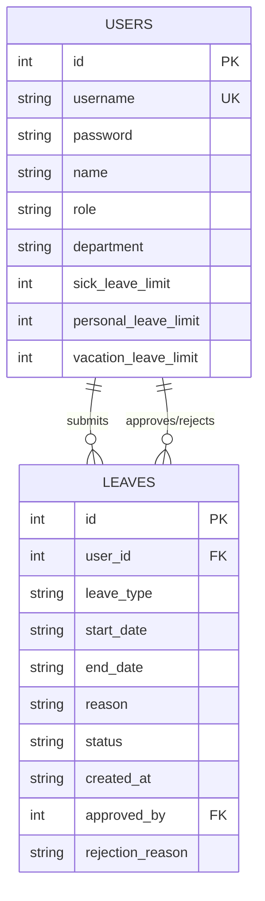

# Database Design - Leave Management System

This document specifies the SQLite database schema and constraints for the Leave Management System. The database is stored in a file named `database.db`.

---

## Entity Relationship Details



---

## Schema Specifications

### 1. `users` Table
Stores user profile information, authentication credentials, organizational roles, and maximum annual leave entitlements.

```sql
CREATE TABLE IF NOT EXISTS users (
    id INTEGER PRIMARY KEY AUTOINCREMENT,
    username TEXT UNIQUE NOT NULL,
    password TEXT NOT NULL,
    name TEXT NOT NULL,
    role TEXT CHECK(role IN ('employee', 'manager', 'hr')) NOT NULL,
    department TEXT NOT NULL,
    sick_leave_limit INTEGER DEFAULT 30,
    personal_leave_limit INTEGER DEFAULT 6,
    vacation_leave_limit INTEGER DEFAULT 10
);
```

### 2. `leaves` Table
Stores individual leave request details, duration, approval workflow state, and references to the reviewer.

```sql
CREATE TABLE IF NOT EXISTS leaves (
    id INTEGER PRIMARY KEY AUTOINCREMENT,
    user_id INTEGER NOT NULL,
    leave_type TEXT CHECK(leave_type IN ('sick', 'personal', 'vacation')) NOT NULL,
    start_date TEXT NOT NULL, -- Format: YYYY-MM-DD
    end_date TEXT NOT NULL,   -- Format: YYYY-MM-DD
    reason TEXT,
    status TEXT CHECK(status IN ('pending', 'approved', 'rejected')) DEFAULT 'pending',
    created_at TEXT NOT NULL, -- Format: YYYY-MM-DD HH:MM:SS
    approved_by INTEGER,      -- Reviewer's user_id
    rejection_reason TEXT,
    FOREIGN KEY(user_id) REFERENCES users(id) ON DELETE CASCADE,
    FOREIGN KEY(approved_by) REFERENCES users(id) ON DELETE SET NULL
);
```

---

## Crucial Operations & Queries

### Calculating Leave Balances
To find the total days used by an employee for a specific leave type in the current year, we calculate the number of days between `start_date` and `end_date` (inclusive) for approved leave requests.

```sql
-- Example: Sum of approved vacation leave days for user_id = 1 in the year 2026
SELECT COALESCE(SUM(
    (strftime('%s', end_date) - strftime('%s', start_date)) / 86400 + 1
), 0) AS days_used
FROM leaves
WHERE user_id = 1
  AND leave_type = 'vacation'
  AND status = 'approved'
  AND (start_date LIKE '2026-%' OR end_date LIKE '2026-%');
```

### Leave Statistics Report (Aggregated by Month/Year)
For HR data visualization, we aggregate approved leaves by month and year.

```sql
SELECT 
    strftime('%Y-%m', start_date) AS leave_month,
    leave_type,
    COUNT(*) AS total_requests,
    SUM((strftime('%s', end_date) - strftime('%s', start_date)) / 86400 + 1) AS total_days
FROM leaves
WHERE status = 'approved'
GROUP BY leave_month, leave_type
ORDER BY leave_month ASC;
```
